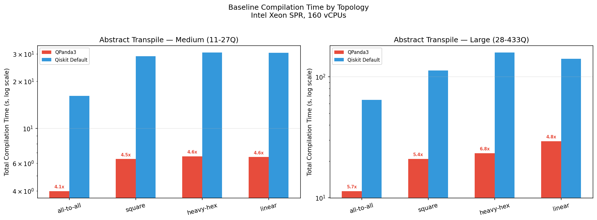
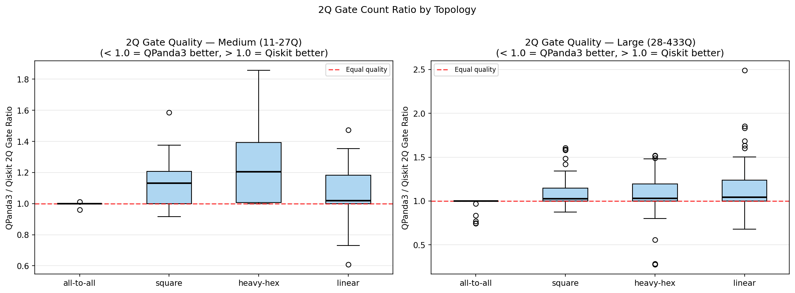
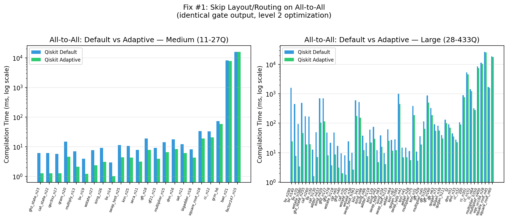
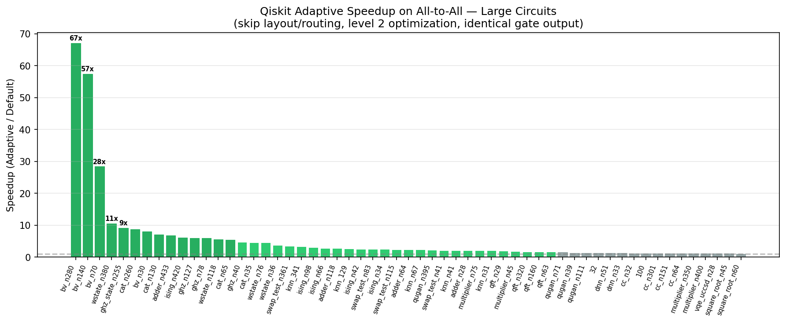

# Abstract Transpile: Benchmarks and Qiskit Optimization Opportunities

## Setup

- **Qiskit version**: 2.3.1 (`optimization_level=2`)
- **QPanda3 version**: 0.3.4 (`optimization_level=2`)
- **Backend**: FlexibleBackend — idealized topologies with no error model
- **Topologies**: all-to-all, square, heavy-hex, linear
- **Basis gates**: Qiskit: cz, id, rz, sx, x | QPanda3: CZ, RZ, X1
- **Circuit suite**: QASMBench Medium (24 circuits, 11–27 qubits) and Large (59 circuits, 28–433 qubits)
- **Platform**: Linux x86_64, Intel Xeon Sapphire Rapids 160 vCPUs, Python 3.11.11
- **Measurement**: Runs executed sequentially (no overlap) for clean measurements

---

## 1. Baseline Comparison: QPanda3 vs Qiskit Default

### Compilation Time



| | Medium (11–27Q) | | | Large (28–433Q) | | |
|---|---|---|---|---|---|---|
| **Topology** | **Qiskit (s)** | **QPanda3 (s)** | **Speedup** | **Qiskit (s)** | **QPanda3 (s)** | **Speedup** |
| all-to-all | 16.15 | 3.99 | 4.1x | 64.60 | 11.34 | 5.7x |
| square | 28.91 | 6.39 | 4.5x | 112.73 | 20.98 | 5.4x |
| heavy-hex | 30.57 | 6.64 | 4.6x | 158.76 | 23.34 | 6.8x |
| linear | 30.50 | 6.57 | 4.6x | 140.59 | 29.30 | 4.8x |
| **Total** | **106.14** | **23.58** | **4.5x** | **476.68** | **84.96** | **5.6x** |

QPanda3 is 4.5–5.6x faster overall. The speed gap widens at scale (5.6x Large vs 4.5x Medium).

### 2Q Gate Quality



| | Medium | | Large | |
|---|---|---|---|---|
| **Topology** | **Gate Ratio** | **Depth Ratio** | **Gate Ratio** | **Depth Ratio** |
| all-to-all | 1.00 (equal) | 0.99 | 0.98 (QPanda3 better) | 1.00 |
| square | 1.12 (+12%) | 1.09 | 1.10 (+10%) | 1.07 |
| heavy-hex | 1.24 (+24%) | 1.16 | 1.06 (+6%) | 1.03 |
| linear | 1.07 (+7%) | 1.06 | 1.17 (+17%) | 1.20 |

*Ratios are QPanda3/Qiskit — values >1.0 mean Qiskit produces fewer gates.*

On all-to-all, both compilers produce equal or near-equal gate counts. On constrained topologies, Qiskit generally produces better results (fewer 2Q gates), especially on square and linear. QPanda3 trades gate quality for compilation speed.

### QPanda3 Failures

QPanda3 fails on circuits containing `reset` gates (bwt, square_root families): 12 out of 232 Large tests. Qiskit handles these without issue.

---

## 2. Identified Qiskit Performance Issues

Two issues stand out from the baseline comparison:

### Issue A: Pass Manager Overhead on All-to-All

On all-to-all topology, routing is unnecessary — every qubit connects to every other. Yet Qiskit still runs VF2Layout and SabreSwap, wasting time. Profiling `cc_n12` (12Q, 59 gates) on all-to-all:

| Pass | Time (ms) | % of Total |
|------|-----------|-----------|
| CommutativeCancellation | 7.2 | 28% |
| ConsolidateBlocks | 5.5 | 22% |
| Optimize1qGatesDecomposition | 3.3 | 13% |
| VF2Layout | 1.6 | 6% |
| **Total** | **25.3** | |

The layout/routing passes (VF2Layout, SabreSwap) are entirely wasted. On larger circuits like `factor247_n15` (660K gates), CommutativeCancellation alone takes 7.7 seconds (50% of total).

Extreme examples: `cc_n12` all-to-all is **93x** slower than QPanda3. `bv_n280` all-to-all takes 1.6s in Qiskit vs 24ms in QPanda3 (**67x**).

### Issue B: SABRE Routing on Large Heavy-Hex Chain Circuits

Qiskit's SABRE router produces **8.5x gate overhead** (vs ~2.3x theoretical minimum) on linear-chain circuits at 100–380 qubits on heavy-hex. Examining `cat_n260`:

| Topology | QPanda3 2Q | Qiskit 2Q | Ratio | Qiskit Time |
|----------|-----------|----------|-------|-------------|
| all-to-all | 259 | 259 | 1.00 | 167ms |
| square | 259 | 259 | 1.00 | 18ms |
| linear | 259 | 259 | 1.00 | 14ms |
| heavy-hex | 606 | 2,194 | 0.28 | 5,299ms |

On all-to-all, square, and linear — identical output (259 gates, zero routing overhead). On heavy-hex, QPanda3 produces 606 gates (~2.3x overhead), Qiskit produces 2,194 (8.5x overhead) and takes 5.3 seconds.

This pattern repeats for all chain-structure circuits at scale:

| Circuit | Qubits | Optimal 2Q | QPanda3 (heavy-hex) | Qiskit (heavy-hex) | Qiskit Overhead |
|---------|--------|-----------|---------------------|-------------------|----------------|
| cat_n260 | 260 | 259 | 606 (2.3x) | 2,194 (8.5x) | 3.6x worse |
| ghz_state_n255 | 255 | 254 | 563 (2.2x) | 2,020 (8.0x) | 3.6x worse |
| wstate_n380 | 380 | 758 | 2,060 (2.7x) | 7,249 (9.6x) | 3.5x worse |
| ising_n98 | 98 | 194 | 317 (1.6x) | 567 (2.9x) | 1.8x worse |

SABRE's heuristic search doesn't efficiently find linear-chain embeddings on heavy-hex at large qubit counts, despite such embeddings being straightforward (walk along the heavy-hex backbone). This is a high-value optimization target since heavy-hex is IBM's production topology.

---

## 3. Fix #1: Skip Layout/Routing on All-to-All

**Implementation**: `benchpress/qiskit_gym/abstract_transpile/test_qasmbench_adaptive.py`

For all-to-all topology, the adaptive pass manager keeps level 2 optimization but skips layout and routing:

```python
pm = generate_preset_pass_manager(optimization_level=2, backend=backend)
pm.layout = None
pm.routing = None
```

### Results

**Gate quality**: Identical 2Q gate counts on every circuit — zero quality loss.





**Medium all-to-all speedups** (selected circuits):

| Circuit | Default (ms) | Adaptive (ms) | Speedup |
|---------|-------------|-------------|---------|
| ghz_state_n23 | 6.2 | 1.3 | 4.8x |
| cat_state_n22 | 6.1 | 1.3 | 4.7x |
| qec9xz_n17 | 5.8 | 1.3 | 4.5x |
| qram_n20 | 15.1 | 4.6 | 3.3x |
| factor247_n15 | 15,874 | 15,875 | 1.0x |

**Large all-to-all speedups** (selected circuits):

| Circuit | Qubits | Default (ms) | Adaptive (ms) | Speedup |
|---------|--------|-------------|-------------|---------|
| bv_n280 | 280 | 1,606 | 24 | **67x** |
| bv_n140 | 140 | 448 | 8 | **57x** |
| bv_n70 | 70 | 95 | 3 | **28x** |
| wstate_n380 | 380 | 493 | 47 | 11x |
| ghz_state_n255 | 255 | 171 | 19 | 9x |
| cat_n260 | 260 | 167 | 19 | 9x |
| ising_n420 | 420 | 702 | 116 | 6x |
| vqe_uccsd_n28 | 28 | 26,941 | 25,334 | 1.1x |

BV circuits see the largest speedup (up to 67x) because VF2Layout was spending significant time on subgraph isomorphism search on the fully-connected graph. Complex circuits (vqe_uccsd, multiplier) see minimal speedup — their time is dominated by optimization passes, not layout/routing.

Total Large all-to-all: 84.8s → 72.4s (1.2x overall, dominated by a few heavy circuits).

---

## 4. Fix #2: Heavy-Hex Chain Routing (TBD)

The SABRE routing issue on large heavy-hex chain circuits (Issue B above) remains open. Potential approaches:
- **Pre-routing pass**: Detect chain-structured circuits and compute a linear embedding before SABRE runs
- **StarPreRouting**: May help for star-like patterns but not pure chains
- **Increased SABRE trials**: More trials might find better solutions but at cost of compilation time

This is the next optimization to investigate.

---

## Summary

| | Speed | Gate Quality |
|---|---|---|
| **Device transpile** (133Q heavy-hex) | QPanda3 4.8x faster | Qiskit 4-58% fewer gates in **all** circuits |
| **Abstract: medium** (11-27Q) | QPanda3 4.5x faster | Qiskit better on constrained topos, equal on all-to-all |
| **Abstract: large** (28-433Q) | QPanda3 5.6x faster | Qiskit better on linear/square, has routing issue on heavy-hex chains |
| **With adaptive (all-to-all)** | Up to 67x improvement | Identical gates (zero quality loss) |

## Files

- `benchpress/qiskit_gym/abstract_transpile/test_qasmbench.py` — Qiskit baseline tests
- `benchpress/qiskit_gym/abstract_transpile/test_qasmbench_adaptive.py` — Qiskit adaptive tests
- `benchpress/qpanda_gym/abstract_transpile/test_qasmbench.py` — QPanda3 tests
- `benchpress/utilities/backends/flexible_backend.py` — FlexibleBackend topology generation
- `benchpress/workouts/abstract_transpile/qasmbench.py` — Test parametrization
- `results/plot_abstract_comparison.py` — Script to regenerate figures
- `.benchmarks/Linux-CPython-3.11-64bit/abstract_*.json` — Raw benchmark JSON data
