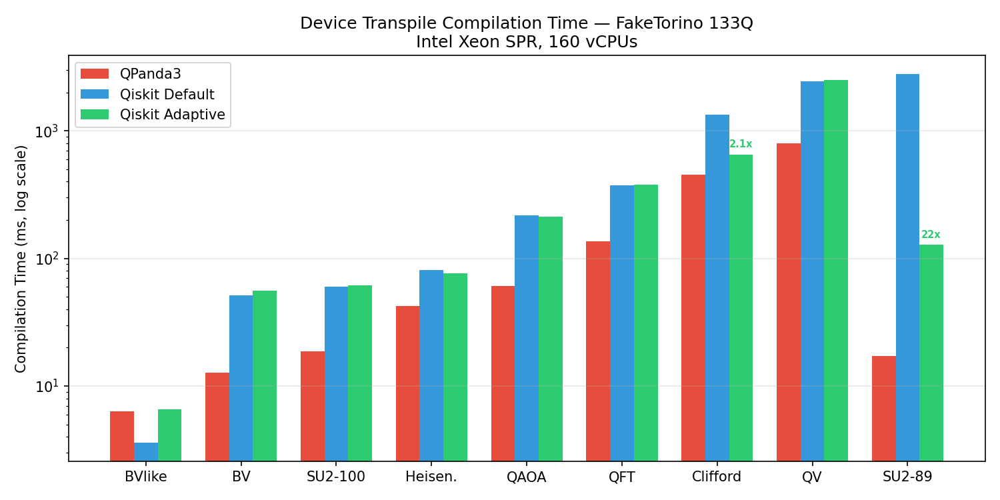
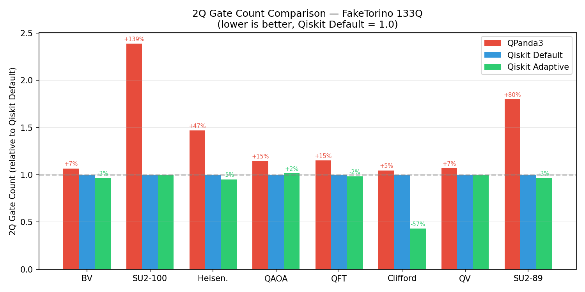
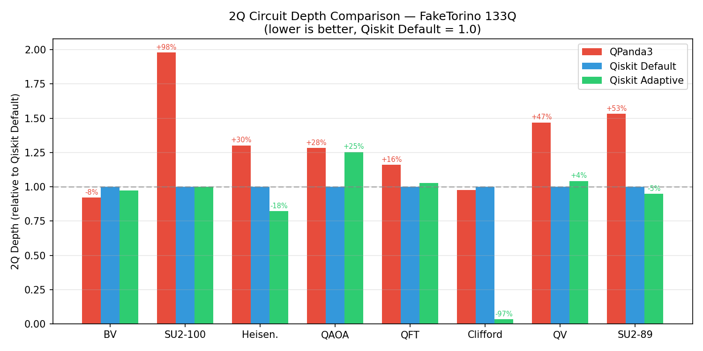

# Device Transpile: QPanda3 vs Qiskit Benchmark Comparison

## Setup

- **Qiskit version**: 2.3.1 (`optimization_level=2`)
- **QPanda3 version**: 0.3.4 (`optimization_level=2`)
- **Backend**: FakeTorino (133-qubit IBM Heron, heavy-hex topology)
- **Qiskit Adaptive**: Circuit-aware pass manager that classifies each circuit and applies a tailored transpilation strategy (e.g., LNN Clifford resynthesis, reduced VF2Layout limits, StarPreRouting). Details in [Adaptive Strategies](#adaptive-strategies) below.
- **Basis gates**: Qiskit: cz, id, rz, sx, x | QPanda3: CZ, RZ, X1
- **Platform**: Linux x86_64, Intel Xeon Sapphire Rapids 160 vCPUs, Python 3.11.11
- **Measurement**: Runs executed sequentially (no overlap) for clean measurements

## Compilation Time



QPanda3 is **4.8x faster** than Qiskit default overall (1.54s vs 7.35s). The Qiskit adaptive pass manager narrows this to **2.6x** (4.08s) by eliminating two major bottlenecks: VF2Layout timeout on circSU2_89 (22x speedup) and inefficient Clifford routing on clifford_100 (2.1x speedup).

Note: on macOS ARM64 (8-12 cores), QPanda3 appears ~200x faster because Qiskit's Rust SABRE routing parallelizes across cores while QPanda3 is single-threaded C++. On the 160-core server, Qiskit scales dramatically and the gap narrows to 3-5x.

## 2Q Gate Count



Qiskit produces **fewer 2Q gates in every circuit** — 4% to 58% fewer than QPanda3 (normalized to Qiskit default = 1.0). The adaptive Clifford resynthesis (LNN) further reduces clifford_100 gates by 57%. QPanda3 trades gate quality for compilation speed.

## 2Q Circuit Depth



Qiskit generally produces lower 2Q depth. The standout is clifford_100 where the adaptive LNN strategy achieves 97% depth reduction (657 vs 19,817 default, vs 19,348 QPanda3). QPanda3 shows notably higher depth on QV (+47%) and circSU2 circuits (+53-98%).

## QV_100 Profiling

### Qiskit (2.2s total)
| Component | Time | % |
|-----------|------|---|
| sabre_layout_and_routing (Rust) | 0.53s | 24% |
| unitary_synthesis (Rust) | 0.40s | 18% |
| commutative_cancellation (Rust) | 0.34s | 16% |
| consolidate_blocks (Rust) | 0.24s | 11% |
| optimize_1q_decomposition (Rust) | 0.24s | 11% |
| depth analysis | 0.13s | 6% |
| basis_translator (Rust) | 0.11s | 5% |
| Other | 0.21s | 9% |

### QPanda3 (0.78s total)
Single monolithic C++ call — no Python-visible breakdown. All routing,
optimization, and basis translation happen inside one `transpile()` call.

## Adaptive Strategies

### 1. `clifford` — Topology-aware Clifford resynthesis

**Applied to**: Circuits with only Clifford gates and high 2Q gate density (>10 per qubit).

Collects Clifford gates into blocks, resynthesizes with LNN decomposition, then decomposes to primitives. LNN produces gates between adjacent virtual qubits so SABRE needs near-zero SWAPs.

```python
hls_config = HLSConfig(clifford=["lnn"])
pre_pm = PassManager([CollectCliffords(), HighLevelSynthesis(hls_config=hls_config)])
circuit = pre_pm.run(circuit).decompose(reps=1)
pm = generate_preset_pass_manager(2, backend)
result = pm.run(circuit)
```

### 2. `parameterized` — Reduce VF2Layout call limit

**Applied to**: Circuits with unbound parameters (e.g., EfficientSU2).

Reduces VF2Layout `call_limit` from (5M, 10K) to (100K, 500). VF2 succeeds quickly when it can, fails fast when it can't.

```python
pm = generate_preset_pass_manager(2, backend)
for task in pm.layout._tasks:
    if isinstance(task, list):
        for item in task:
            passes = getattr(item, 'passes', None)
            if passes is not None:
                if callable(passes):
                    passes = passes()
                for p in passes:
                    if isinstance(p, VF2Layout):
                        p.call_limit = (100_000, 500)
result = pm.run(circuit)
```

### 3. `star` — StarPreRouting for star-topology circuits

**Applied to**: Circuits where one qubit participates in >60% of all 2Q gates.

```python
pm = generate_preset_pass_manager(2, backend)
pm.pre_init = PassManager([StarPreRouting()])
result = pm.run(circuit)
```

### 4. `default` — Standard Qiskit level 2

**Applied to**: All other circuits.

### Circuit Classification

| Circuit | Classification | Strategy |
|---------|---------------|----------|
| BVlike_simplification | default | Standard level 2 |
| BV_100 | star | StarPreRouting (hub qubit has >60% of 2Q gates) |
| circSU2_89 | parameterized | Reduced VF2Layout call_limit (100K, 500) |
| circSU2_100 | parameterized | Reduced VF2Layout call_limit (100K, 500) |
| square_heisenberg_100 | default | Standard level 2 |
| QAOA_100 | parameterized | Reduced VF2Layout call_limit (100K, 500) |
| QFT_100 | default | Standard level 2 |
| clifford_100 | clifford | LNN resynthesis + decompose |
| QV_100 | default | Standard level 2 |

```python
def classify(circuit):
    if circuit.num_parameters > 0:
        return "parameterized"
    if no_non_clifford_gates and (total_2q / num_qubits > 10):
        return "clifford"
    if max_qubit_2q_count > 0.6 * total_2q:
        return "star"
    return "default"
```

## Files

- `benchpress/qiskit_gym/device_transpile/test_summit.py` — Qiskit baseline
- `benchpress/qiskit_gym/device_transpile/test_summit_adaptive.py` — Qiskit adaptive
- `benchpress/qpanda_gym/device_transpile/test_summit.py` — QPanda3 baseline
- `results/plot_comparison.py` — Script to regenerate figures
- `.benchmarks/Linux-CPython-3.11-64bit/` — Raw benchmark JSON data

## Notes on QPanda3 Paper Claims

The QPanda3 paper (Section 8, Compilation Efficiency) claims:

- **Gate quality**: "for both 2Q Gate Count and 2Q Gate Depth, the majority of the scatter points are densely distributed along or very close to the [equal] line, suggesting that the performance of QPanda3 and qiskit is essentially the same."
- **Compilation speed**: 7–597x speedup over Qiskit across topologies (all-to-all 7x avg, square 16x avg, heavy-hex 12x avg, linear 7x avg).

Our benchmarks on heavy-hex (FakeTorino 133Q) show different results:

1. **Gate quality is not "essentially the same"** — Qiskit produces 4–58% fewer 2Q gates in every circuit, and generally lower 2Q depth. QPanda3 trades gate quality for speed.
2. **Speedup is much smaller on many-core servers** — We measure 4.8x (not 12x) on 160-core Intel SPR. The paper used Xeon Platinum 8336C (likely fewer cores); Qiskit's Rust SABRE routing scales with cores while QPanda3's C++ is single-threaded. On macOS ARM64 (8 cores) we see ~200x, consistent with their high-end claims.
3. **The paper does not break down gate quality by category** — scatter plots aggregate all 1,066 Benchpress test cases across topologies. This can mask systematic deficits on structured algorithm circuits (QV, QFT, QAOA, Clifford, etc.) where Qiskit's optimization passes have more to work with.
4. **The paper benchmarks with Qiskit 2.0.1** — we used Qiskit 2.3.1, which includes further Rust optimizations.
